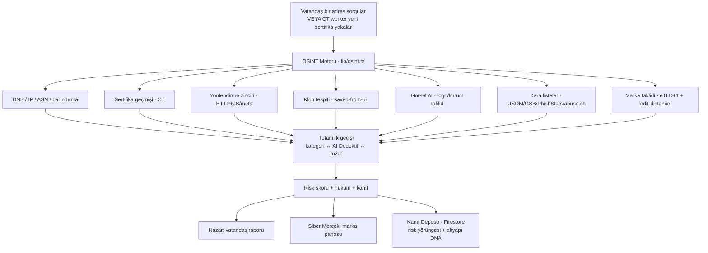

# SİTS · Nazar — Siber Dolandırıcılık Koruma & Marka Tehdit İstihbaratı

Türkiye için iki katmanlı bir siber güvenlik platformu:

- **Nazar** (vatandaş) — "Bu link / mesaj / IBAN / telefon dolandırıcı mı?" sorusunu anında, düz Türkçe yanıtlar.
- **Siber Mercek** (kurumsal/B2B) — internette bir markaya yönelik saldırıları **daha oluşurken** canlı yakalar; her marka yalnız kendi tehditlerini görür.

Aynı **açık-kaynak istihbarat (OSINT) motorunu** paylaşırlar: bir tarafta tek bir vatandaş bir adresi sorgular, diğer tarafta sistem 7/24 tüm interneti tarayıp markaları taklit eden sahte siteleri kendisi bulur.

---

## Ne işe yarar?

### 1. Nazar — vatandaş koruması
Bir vatandaş şüpheli bir şey (link, SMS, WhatsApp mesajı, IBAN, telefon, kripto adresi) yapıştırır. Sistem:
- Adresi **~20 açık kaynakta** analiz eder (USOM, sertifika geçmişi, DNS, yönlendirme zinciri, klon tespiti, görsel-AI logo taklidi, kara listeler…).
- **0–100 risk skoru** + düz Türkçe bir hüküm verir ("Bu Garanti taklidi, bilgi girme").
- **Neden şüphelendiğini** madde madde açıklar (savunulabilir, uydurma yok).
- Gerekirse **profesyonel OSINT raporu + hazır dilekçe** üretir, USOM'a bildirmeye yönlendirir.

**İlke:** kusursuz, yanlış-pozitif yok, dürüstlük. Sistem asla sahip olmadığı bir yeteneği iddia etmez; markanın kendi resmî siteleri asla "sahte" işaretlenmez.

### 2. Siber Mercek — marka tehdit istihbaratı
Bir marka (banka, havayolu, savunma sanayi…) kendi resmî adreslerini kaydeder. Sistem:
- **Certificate Transparency (CT)** loglarını canlı dinleyerek internette **yeni yayınlanan her sertifikayı** görür.
- Markanın adını taşıyan ama resmî adresi **olmayan** her domaini yakalar.
- Her tespiti tam analiz eder: risk, saldırı-aşaması, altyapı-DNA, kardeş kampanya.
- Markaya özel bir **operasyon panosuna** (`/mercek`) düşürür — her marka yalnız kendi tehditlerini görür.

---

## Nasıl çalışır? (tespit hattı)



### Canlı yakalama (CT worker)
`certstream-worker/` — Fly.io'da 7/24 çalışan bağımsız bir Node servisi:
- Google'ın CT log listesinden **tüm aktif operatörleri** (Google, Cloudflare, DigiCert, Sectigo, TrustAsia) dinler.
- Her sertifikanın ham byte'larında ucuz bir **ön-filtre** ile korunan marka kelimelerini arar; eşleşmezse ayrıştırma yapmaz (küçük makine tüm akışa yetişir).
- CT kuralı her sertifikayı ≥2 operatöre zorladığı için, tüm operatörler dinlenince pratikte hiçbir güvenilir sertifika kaçmaz.
- **İki bölge:** Frankfurt (`sits-marka-avci`) + Singapur (`sits-marka-avci-asia`, yalnız TrustAsia — Frankfurt'tan erişilemediği için).
- Operatör-başına gecikme telemetrisi + Google-dışı bir operatör geride kalırsa sesli uyarı.

### Zamansal + ilişkisel katman (Siber Mercek farkı)
Rakiplerden fark "daha çok veri kaynağı" değil, veriyi **zamanda ve ilişkide** anlamlandırmak:
- **Risk yörüngesi** — aday domain periyodik yeniden taranır; risk 8→31→96 gelişimi + saldırı olgunlaşma aşaması (Domain kaydı → DNS → TLS → Web → Marka varlıkları → Login formu → Kimlik toplama) kaydedilir.
- **Altyapı DNA'sı** — favicon + NS + sertifika CA + ASN'den bir parmak izi; aynı imzayı taşıyan farklı domainler **aynı kampanya** olarak kümelenir.
- **Kanıt Deposu** — her analiz kalıcı saklanır (delil dosyası).

---

## Ekranlar

| Yol | Kitle | Ne yapar |
|-----|-------|----------|
| `/` | Vatandaş | Sorgula / Bildir kapıları |
| `/sorgula` | Vatandaş | Link/IBAN/telefon/mesaj analizi + OSINT raporu |
| `/gorsel` | Vatandaş | Ekran görüntüsü/fotoğraf ile sorgu |
| `/nazar` | Vatandaş | Sohbetle danışma |
| `/mercek` | Marka (girişli) | **Operasyon kokpiti** — canlı tehdit listesi, inceleme paneli, saldırı-aşaması, altyapı-DNA, kardeş kampanya |
| `/marka-giris` | Marka | Giriş / kayıt (+ resmî adres allowlist) |
| `/marka-koruma` | Marka | Marka koruma + günlük rapor |
| `/kampanya` | Operatör | Bir sahte siteden tüm operasyonu çıkar |
| `/servisler` | — | Tüm servislerin dizini |

### Marka girişi & izolasyon
- Firebase Auth (e-posta/parola). Her hesap `marka_hesaplari/{uid}` ile **bir markaya kilitli**.
- Kayıtta marka **resmî adreslerini** girer → `kullanici_markalari` allowlist'ine yazılır → bunların **dışındaki** her taklit sahte sayılır, kendi siteleri asla yanlış-alarm vermez.
- Firestore kuralı: hesap yalnız **kendi** eşlemesini okur/yaratır (başkasının markasını göremez, değiştiremez).

---

## Mimari & teknoloji

- **Frontend/Backend:** Next.js 16 (App Router, Turbopack) — sayfalar + `/api/*` route'ları
- **Stil:** Tailwind; Siber Mercek: IBM Plex + lacivert kurumsal ops-konsol dili
- **Veritabanı/Auth:** Firebase (Firestore + Auth), client SDK
- **Barındırma:** Vercel (app) + Fly.io (CT worker'lar)
- **AI:** Gemini (görsel analiz, AI Dedektif hükmü)
- **Dış servisler:** urlscan.io, VirusTotal, USOM, Google Safe Browsing, PhishStats, abuse.ch, AbuseIPDB, IPQS

### Önemli klasörler
```
app/            # sayfalar + API route'ları (Next.js App Router)
lib/            # motor: osint.ts, store.ts, korunanMarkalar.ts, markaAuth.ts, yenidenTara.ts …
components/     # paylaşılan React bileşenleri
certstream-worker/  # Fly.io CT dinleyici (bağımsız Node servisi)
firestore.rules # Firestore güvenlik kuralları
```

### Firestore koleksiyonları
`gostergeler` (halka açık sorgu istatistikleri) · `marka_adaylari` (yakalanan sahte adaylar) · `analizler` (Kanıt Deposu + risk yörüngesi + DNA) · `kullanici_markalari` (marka allowlist) · `marka_hesaplari` (giriş → marka kilidi) · `kampanyalar` · `raporlar` · `izleme_eposta`

---

## Sıfırdan indir & çalıştır

### 0. Gereksinimler (bir kez)
- **Node.js 20+** — [nodejs.org](https://nodejs.org) (npm ile birlikte gelir)
- **Git** — [git-scm.com](https://git-scm.com)

Kurulu mu kontrol:
```bash
node -v    # v20.x veya üstü
git --version
```

### 1. Projeyi indir (clone)
```bash
git clone https://github.com/OgzhnAydn/sits.git
cd sits
```

### 2. Bağımlılıkları kur
```bash
npm install
```

### 3. Çalıştır
```bash
npm run dev
```
Tarayıcıda aç: **http://localhost:3000**

> **Anahtarsız da çalışır** (demo modu) — hiçbir ayar yapmadan `npm run dev` ile açılır, sayfaları gezebilirsin. Gerçek analiz/canlı veri için aşağıdaki anahtarları ekle.

### 4. (İsteğe bağlı) Gerçek moda geç
Proje kökünde **`.env.local`** dosyası oluştur ve anahtarları gir (aşağıya bak). Sonra dev sunucusunu **yeniden başlat** (`npm run dev`) — Next.js `.env`'i yalnız başlangıçta okur.

### 5. (İsteğe bağlı) Canlı yayına çıkar
`npm run build` ile üretim derlemesi yapılır; deploy komutları en altta.

---

## Anahtarlar (.env.local)

**Anahtarsız da çalışır** (demo modu); `.env.local`'e anahtar girilince gerçeğe geçer:

```bash
NEXT_PUBLIC_FIREBASE_API_KEY=...
NEXT_PUBLIC_FIREBASE_PROJECT_ID=siber-bildir
NEXT_PUBLIC_FIREBASE_APP_ID=...
GEMINI_API_KEY=...          # görsel AI + Dedektif
URLSCAN_KEY=...             # ekran görüntüsü + zengin tarama
VIRUSTOTAL_KEY=...          # kara liste
GOOGLE_SAFEBROWSING_KEY=...
ABUSEIPDB_KEY=... IPQS_KEY=... ABUSECH_KEY=...
```

> `.env.local`, `.next/`, `.vercel/` **git'e girmez** (`.gitignore`). Gizli anahtarları asla commit'leme.

### Deploy
```bash
vercel deploy --prod --force --yes                        # app (Vercel)
firebase deploy --only firestore:rules --project siber-bildir   # Firestore kuralları
cd certstream-worker && fly deploy -a sits-marka-avci     # CT worker (Fly)
```

### CT worker'ı çalıştırma
```bash
cd certstream-worker
fly secrets set MARKA_ADAY_SECRET=...   # SİTS ile aynı sır (POST doğrulaması)
fly deploy -a sits-marka-avci
```
Worker `/api/markalar`'ı 6 saatte bir çeker (yeni marka için `fly machine restart` ile hızlandır).

---

## Tasarım ilkeleri

- **Kusursuz & yanlış-pozitif yok** — markanın kendi/resmî adresine yönlendirme meşruluk kanıtıdır; paylaşımlı IP/CDN itibarı domaine yıkılmaz; kategori ↔ AI Dedektif ↔ üst rozet asla çelişmez.
- **Dürüstlük** — "kontrol ettiğimiz açık listelerde yok" denir, "hiçbir yerde yok" DENMEZ (kurumsal filtreler görülemez). Ölçülebilir kapsam, sahte sayaç yok.
- **Sadelik** — her ekran son kullanıcı gözünden anlaşılır olmalı; gürültü/karmaşa yok.

---

*Resmî bir devlet uygulaması değildir. Acil durumda 155 / 112.*
